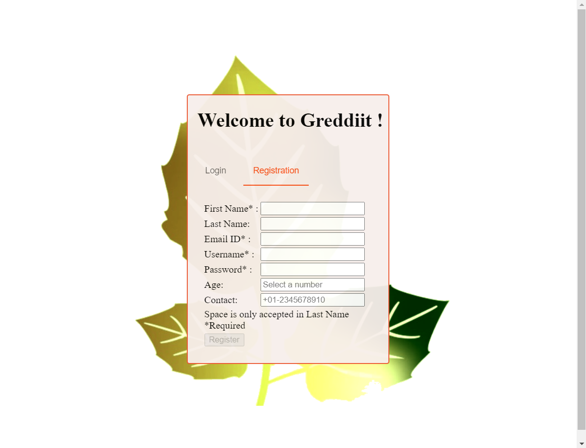
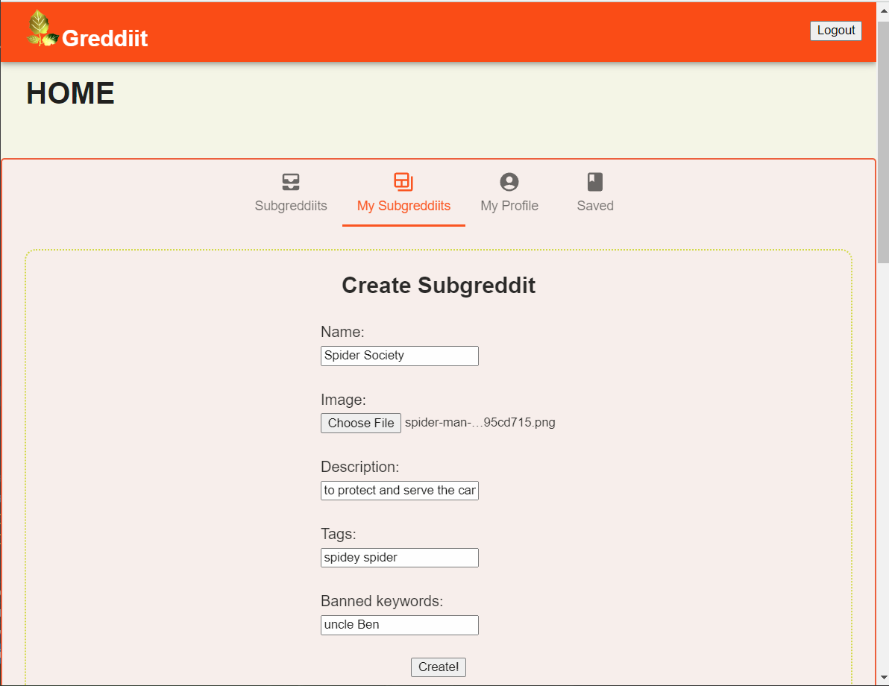
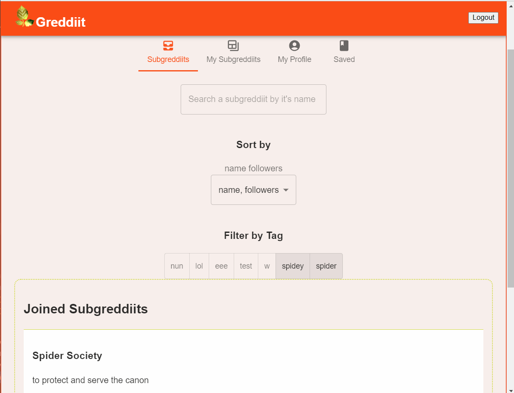
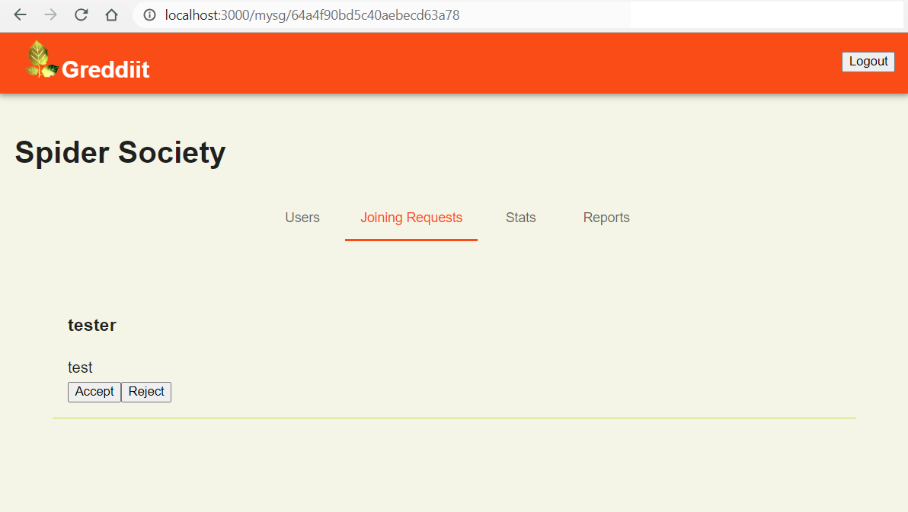
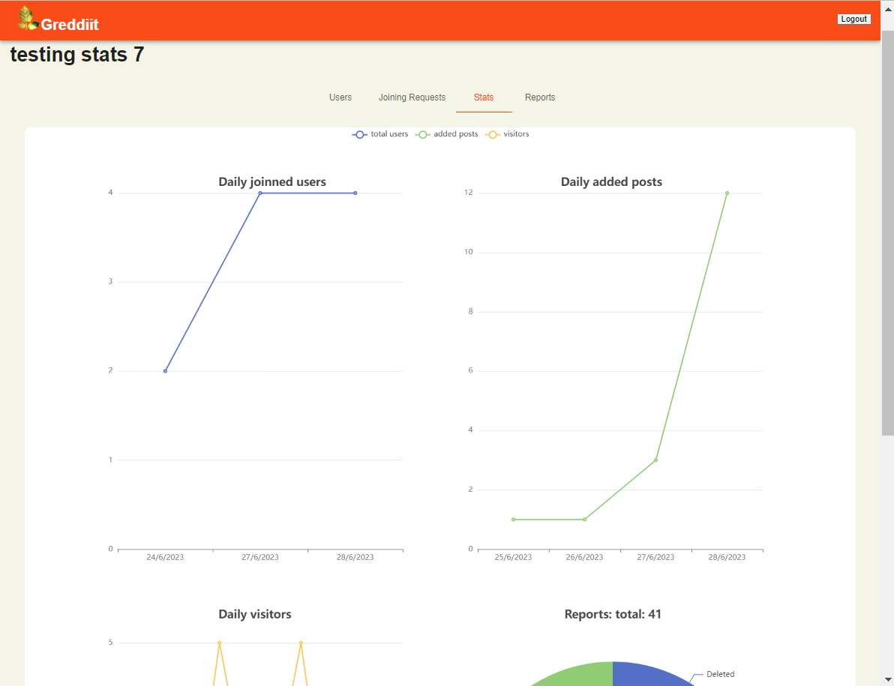
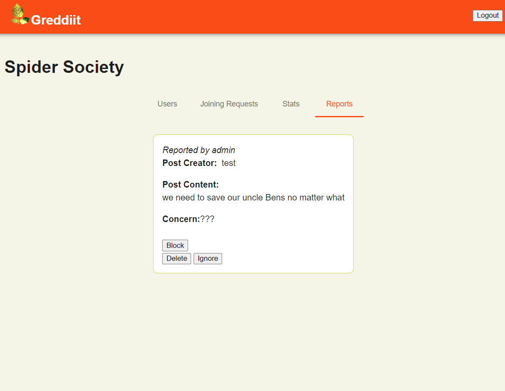
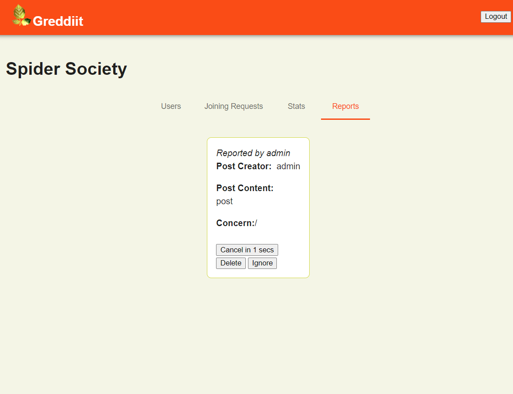
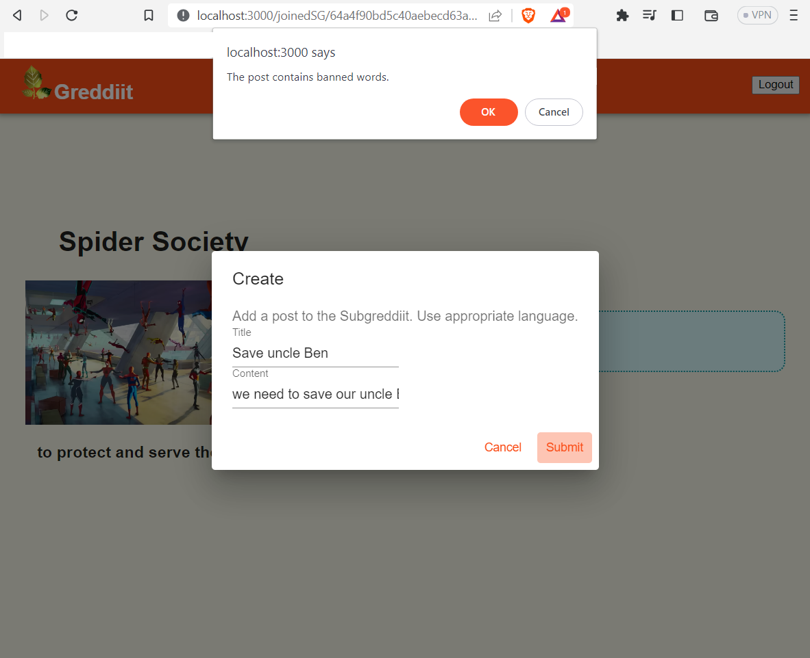
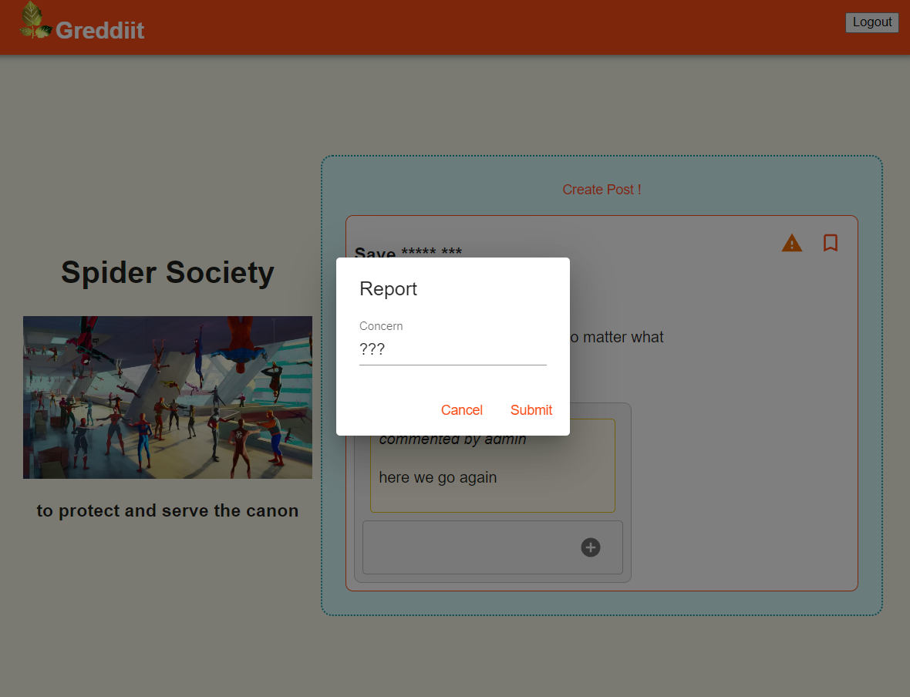

# GREDDIIT
## *Reddit, but different* 
### Made as an assignment for the course Design and Analysis of Software Systems (S23CS6.301)
____

## How to run?

- Running without docker:
  - > ./\<root>/frontend> npm start
  - > ./\<root>/backend> npm start
- Running with docker:
  - > ./\<root>>
    - > docker compose build
    - > docker compose up
- open "localhost:3000" in browser

___
All the basic requirements were implemented. 
Bonus implemented:
- Upload image while creating a subgreddiit, and show it when it's page is opened
- Displaying stats in form of graphs.
- For the list of all subgreddiits, implemented:
    - Fuzzy search
    - Nested sort

## Some highlights:

<!-- Login/Register

   -->

- <figure>
    <figcaption>
    Login/Register
    </figcaption>
    
  </figure> 
- <figure>
  <figcaption>
    Create a SG (subgreddiit)
    </figcaption>
  
  </figure> 
- <figure>
  <figcaption>
  Search an SG from the list of all SGs
  </figcaption>
  
  </figure> 

- <figure>
  <figcaption>
    Accept/Reject the joinning requests
    </figcaption>
    
  </figure>
   

- <figure>
  <figcaption>
  View statistics of your SG
  </figcaption>
  
  </figure> 

- <figure>
  <figcaption>
  Manage reports of your SG: Block user, Delete the post, or Ignore the Report
  </figcaption>
  
  </figure> 
- <figure>
    <figcaption>
  Timer for clocking the user
  </figcaption>
  
  </figure> 

- <figure>
  <figcaption>
  Create a post in an SG. after joinning it.
  </figcaption>
  
  </figure> 

- <figure>
  <figcaption>
  Report a post to the moderator
  </figcaption>
  
  </figure> 

___
For more details, refer to the [assignment document](assignment.pdf).